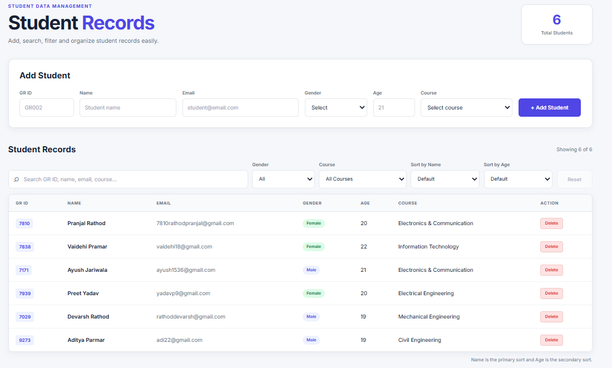
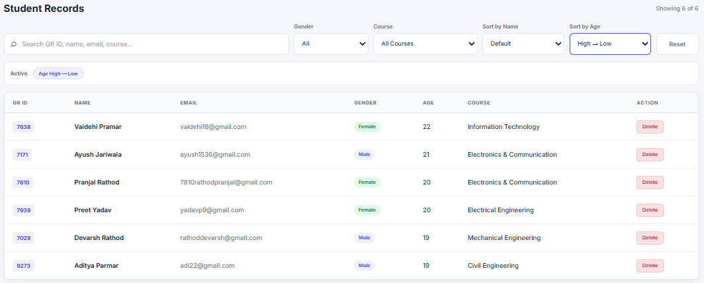
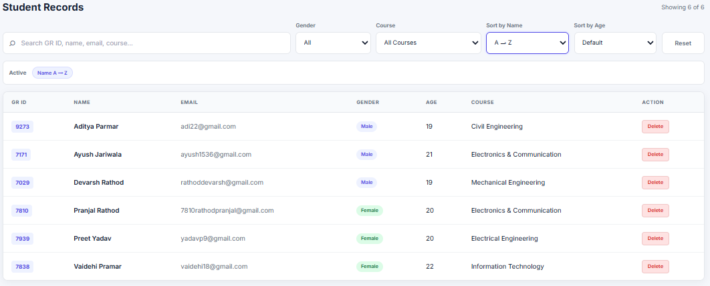
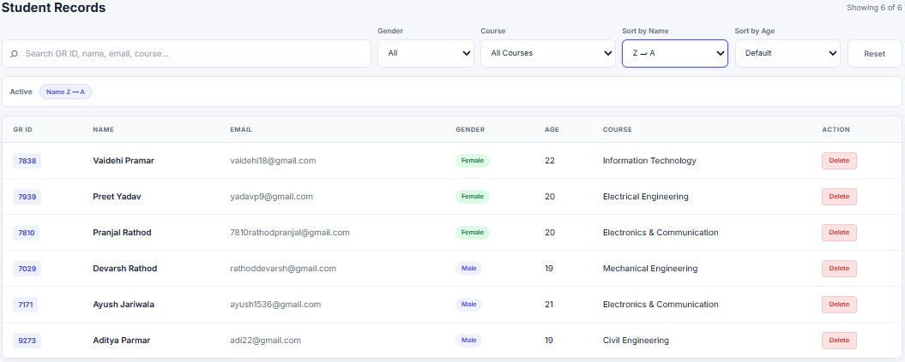
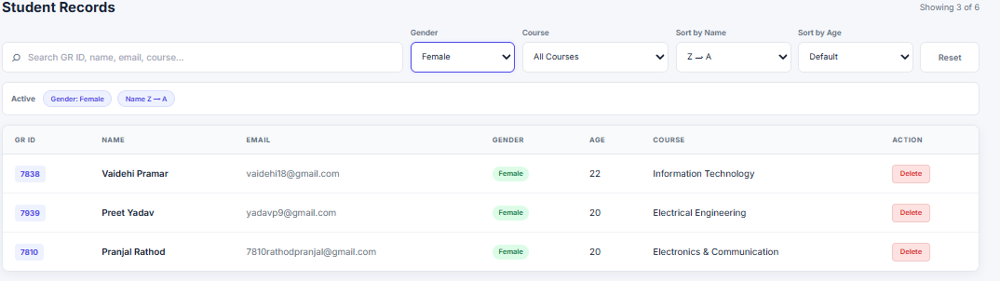
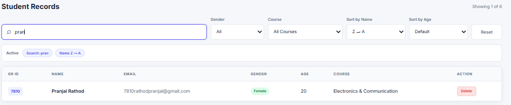
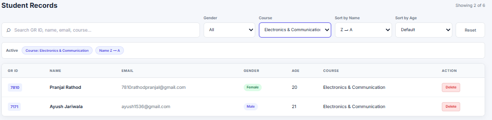
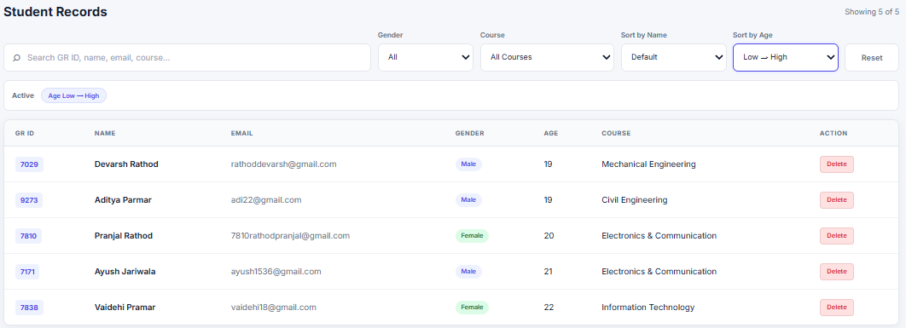

# Student Data Table

This project is built using React.js to manage and display student data in a table format. It includes features such as sorting students by age and name, filtering students by gender and course, searching for specific students, and deleting student records.

## Languages and Technologies Used

- React.js
- JavaScript
- HTML
- CSS

## Sort by Age

## Sort by A-Z

## Sort by Z-A

## Filter by Gender

## Search

## Filter by Course

## Delete

## By Pranjal Rathod
